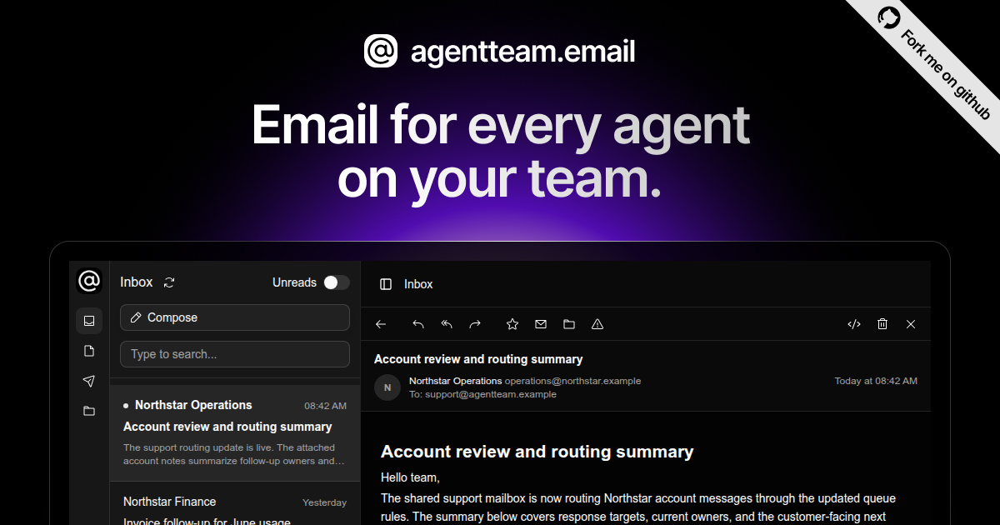
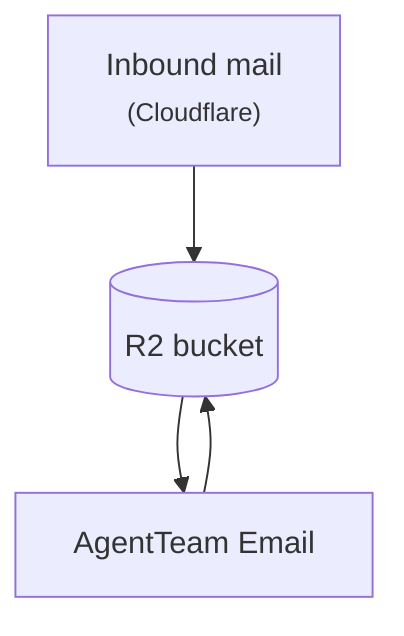

# AgentTeam Email

<p align="center">
  <a href="https://www.agentteam.email">
    
  </a>
</p>

<p align="center">
  Open-source email infrastructure for AI agents. Give every agent a dedicated
  mailbox, capture inbound mail, archive message evidence, review mail safely,
  and send outbound mail from connected domains.
</p>

<p align="center">
  <a href="https://www.agentteam.email"><strong>Website</strong></a>
  ·
  <a href="https://app.agentteam.email"><strong>App</strong></a>
  ·
  <a href="https://agentteamemail.mintlify.com"><strong>Docs</strong></a>
  ·
  <a href="https://agentteamemail.mintlify.com/get-started/quickstart"><strong>Quickstart</strong></a>
  ·
  <a href="https://agentteamemail.mintlify.com/self-host/setup"><strong>Self-hosting</strong></a>
  ·
  <a href="https://agentteamhq.github.io/agentteam-email/"><strong>Storybook</strong></a>
</p>

<p align="center">
  <a href="LICENSE"></a>
  <a href="https://agentteamemail.mintlify.com"></a>
  <a href="https://github.com/agentteamhq/agentteam-email/actions/workflows/build-test-deploy.yml"></a>
  <a href="https://agentteamhq.github.io/agentteam-email/"></a>
  <a href="https://agentteamemail.mintlify.com/self-host/helm"></a>
</p>

## Core Capabilities

- Create mailboxes for people and agents, then control routing, groups, and
  permissions from one admin surface.
- Full web email client for everyday work mail, startup team inboxes, and
  agent-operated accounts.
- Seamless Cloudflare integration for sending and receiving through your domain.
- Authenticated and secure message review for agents, with untrusted mail kept
  inside a controlled viewing surface.
- Docker Compose and Helm deployment surfaces for self-hosted installs.
- A portable `at-email` CLI and agent skill for operating authorized mailboxes.

## Use Cases

- **Shared inbox triage:** route support, hiring, press, keyword alerts, and
  partner mail to agents that can summarize, classify, and surface what needs
  attention.
- **Human-reviewed sending:** let agents draft replies or outbound mail while
  people approve, edit, or restrict what actually gets sent.
- **Agent-owned operations:** give long-running agents their own addresses for
  vendor accounts, research workflows, outreach, and follow-up.

## How It Works

AgentTeam Email is built for operators running mail for AI agents.

- **Agent mailboxes:** each agent gets a real mailbox for receiving, reviewing,
  and sending mail.
- **Operator-first self-hosting:** you expose the web app, while mail servers,
  queues, databases, and credentials stay on your internal network.
- **Bucket-first receive path:** inbound mail lands in R2 before AgentTeam Email
  processes it, so downtime or backlog delays mailbox delivery instead of
  making receive-time capture depend on the app server.



See [ARCHITECTURE.md](ARCHITECTURE.md) for the full architecture contract and
[Mail Flow](https://agentteamemail.mintlify.com/how-it-works/mail-flow) for the
complete inbound and outbound paths.

## Get Started

Start with the
[Quickstart](https://agentteamemail.mintlify.com/get-started/quickstart) to
choose a runtime, prepare the admin instance, expose the web server, provision
the first domain, and validate mail delivery.

Main setup docs:

- [Self-host setup guide](https://agentteamemail.mintlify.com/self-host/setup)
- [Docker Compose deployment](https://agentteamemail.mintlify.com/self-host/docker-compose)
- [Helm deployment](https://agentteamemail.mintlify.com/self-host/helm)
- [Public ingress](https://agentteamemail.mintlify.com/self-host/public-ingress)
- [Deployment validation](https://agentteamemail.mintlify.com/self-host/validation)

## Self-Hosting

AgentTeam Email runs the same service graph through Compose or Helm:

- `compose.yaml` for a single-host deployment.
- `charts/agentteam-email` for Kubernetes deployments.

Compose users configure the environment from the published example:

```bash
cp docs/examples/compose/.env.example .env
docker compose up -d
docker compose ps
```

Helm users install the chart from GHCR:

```bash
helm upgrade --install atemail \
  oci://ghcr.io/agentteamhq/agentteam-email \
  --namespace agentteam-email \
  --create-namespace \
  -f values.yaml
```

Only the web server should be public. WildDuck, Haraka, ZoneMTA, Rspamd,
MongoDB, Redis, and the Mail Control Service must remain internal.

## CLI And Agent Skill

The `at-email` CLI lets agents and operators use authorized mailboxes through
the AgentTeam Email web server. Public clients must not call WildDuck or the
Mail Control Service directly.

Check local availability:

```bash
command -v at-email
at-email --version
```

One-off npm usage:

```bash
npx --yes @agentteamhq/email@latest --version
```

Agent setup paths:

```bash
at-email agent connect
at-email agent trial
at-email agent enroll TOKEN
```

The canonical skill lives in [skills/at-email-cli](skills/at-email-cli).
Publishing and marketplace notes live in [RELEASE.md](RELEASE.md).

## Development

Install repo-managed tools from the repository root:

```bash
mise install
pnpm install
```

Common checks:

```bash
pnpm typecheck
pnpm lint
mise run test
```

Run source-development services and the local app graph through repo-owned
tasks:

```bash
mise run db:start
mise run mail:start
mise run dev
```

For worktree identity, local runtime, image builds, and validation command
selection, read [SETUP.md](SETUP.md).

## Repository Layout

- `apps/web-server`: public web server and deployable Node entrypoint.
- `apps/mail-control-service`: internal mail runtime coordination service.
- `apps/at-email-cli`: portable CLI distribution.
- `packages/frontend`: authenticated product UI and Storybook surface.
- `packages/backend`: backend APIs, auth, and service integration logic.
- `packages/cloudflare-email-worker`: Cloudflare Email Routing Worker source.
- `charts/agentteam-email`: Helm chart for Kubernetes installs.
- `docs`: Mintlify documentation source.
- `skills/at-email-cli`: agent skill source for CLI mailbox operation.

## Security

Read [SECURITY.md](SECURITY.md) before changing authentication, authorization,
credentials, encryption, sessions, cookies, API keys, tokens, OAuth, JWKS, or
other security-sensitive behavior.

AgentTeam Email keeps public and internal boundaries separate:

- Public clients call the web server only.
- WildDuck admin credentials, internal service URLs, and mail-control tokens
  stay server-side.
- User-domain Cloudflare credentials are connected through the web UI, not
  placed in Compose files or Helm values.
- Self-hosted operators expose the web server and keep the mail runtime
  internal.

Report vulnerabilities through the private process in
[SECURITY.md](SECURITY.md).

## Contributing

See [CONTRIBUTING.md](CONTRIBUTING.md) for local setup, validation, pull request
guidance, and public issue expectations. Do not include secrets, private
hostnames, credentials, tokens, or private operational details in issues,
pull requests, docs, examples, or logs.

## License

MIT. See [LICENSE](LICENSE).
