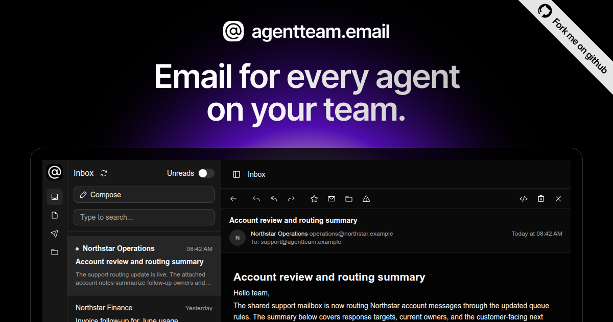
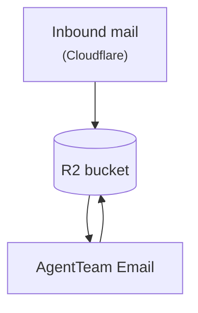

# AgentTeam Email

<p align="center">
  <a href="https://www.agentteam.email">
    
  </a>
</p>

<p align="center">
  Open-source email infrastructure for AI agents. Give every agent a dedicated
  mailbox, review untrusted mail safely, and send outbound mail from connected
  domains.
</p>

<p align="center">
  <a href="https://www.agentteam.email"><strong>Website</strong></a>
  ·
  <a href="https://app.agentteam.email"><strong>App</strong></a>
  ·
  <a href="https://agentteamemail.mintlify.com"><strong>Docs</strong></a>
  ·
  <a href="https://agentteamemail.mintlify.com/get-started/quickstart"><strong>Quickstart</strong></a>
  ·
  <a href="https://agentteamemail.mintlify.com/self-host/setup"><strong>Self-hosting</strong></a>
  ·
  <a href="https://agentteamhq.github.io/agentteam-email/"><strong>Storybook</strong></a>
</p>

<p align="center">
  <a href="LICENSE"></a>
  <a href="https://agentteamemail.mintlify.com"></a>
  <a href="https://github.com/agentteamhq/agentteam-email/actions/workflows/build-test-deploy.yml"></a>
  <a href="https://agentteamhq.github.io/agentteam-email/"></a>
  <a href="https://agentteamemail.mintlify.com/self-host/helm"></a>
</p>

## Core Capabilities

- Create mailboxes for people and agents, then control routing, groups, and
  permissions from one admin surface.
- Full web email client for everyday work mail, startup team inboxes, and
  agent-operated accounts.
- Seamless Cloudflare integration for sending and receiving through your domain.
- Safe message review for agents, with untrusted mail opened in a dedicated
  product surface.
- Self-hosted deployment with Docker Compose or Helm.
- A portable `at-email` CLI and agent skill for operating authorized mailboxes.

## Why It Matters

- **Give agents real inboxes without handing them your inbox:** agents can read,
  draft, and send through scoped mailbox access instead of broad personal account
  access.
- **Start self-hosted and keep ownership:** run it yourself, adapt it to your
  workflow, and contribute changes back under a permissive license.

## Use Cases

- **Shared inbox triage:** route support, hiring, press, keyword alerts, and
  partner mail to agents that can summarize, classify, and surface what needs
  attention.
- **Human-reviewed sending:** let agents draft replies or outbound mail while
  people approve, edit, or restrict what actually gets sent.
- **Agent-owned operations:** give long-running agents their own addresses for
  vendor accounts, research workflows, outreach, and follow-up.

## How It Works

AgentTeam Email is built for operators running mail for AI agents.

- **Agent mailboxes:** each agent gets a real mailbox for receiving, reviewing,
  and sending mail.
- **Operator-first self-hosting:** run the web app and mail services on your own
  infrastructure.
- **Bucket-first receive path:** inbound mail lands in R2 before AgentTeam Email
  processes it, so backlog or downtime affects processing instead of initial
  receipt.


```mermaid
%%{init: {"flowchart": {"curve": "basis"}}}%%
flowchart TB
  mail["Inbound mail<br/><small>(Cloudflare)</small>"] --> bucket[(R2 bucket)]
  bucket --> app[AgentTeam Email]
  app --> bucket
```

For deeper detail, see [ARCHITECTURE.md](ARCHITECTURE.md) and
[Mail Flow](https://agentteamemail.mintlify.com/how-it-works/mail-flow).

## Get Started

Start with the
[Quickstart](https://agentteamemail.mintlify.com/get-started/quickstart) to
go from install to your first connected domain and mailbox.

Useful setup docs:

- [Self-host setup guide](https://agentteamemail.mintlify.com/self-host/setup)
- [Docker Compose deployment](https://agentteamemail.mintlify.com/self-host/docker-compose)
- [Helm deployment](https://agentteamemail.mintlify.com/self-host/helm)
- [Public ingress](https://agentteamemail.mintlify.com/self-host/public-ingress)
- [Deployment validation](https://agentteamemail.mintlify.com/self-host/validation)

## Self-Hosting

AgentTeam Email can run on one host with Docker Compose or on Kubernetes with
Helm. The self-hosting docs cover environment setup, Cloudflare connection, R2
storage, ingress, and post-install checks.

- [Deploy with Docker Compose](https://agentteamemail.mintlify.com/self-host/docker-compose)
- [Deploy with Helm](https://agentteamemail.mintlify.com/self-host/helm)

## CLI And Agent Skill

The `at-email` CLI lets agents and operators check mailbox status, review
messages, search mail, and send approved outbound email.

Check local availability:

```bash
command -v at-email
at-email --version
```

One-off npm usage:

```bash
npx --yes @agentteamhq/email@latest --version
```

Agent setup paths:

```bash
at-email agent connect
at-email agent trial
at-email agent enroll TOKEN
```

The bundled agent skill lives in [skills/at-email-cli](skills/at-email-cli).
Read the
[CLI and agent skill docs](https://agentteamemail.mintlify.com/usage/cli-and-agent-skill)
for the full workflow.

## Development

Install repo-managed tools from the repository root:

```bash
mise install
pnpm install
```

For the full local development workflow, read [SETUP.md](SETUP.md).

## Repository Layout

- `apps/web-server`: deployable web app and Node server.
- `apps/mail-control-service`: mail runtime coordination service.
- `apps/at-email-cli`: portable CLI distribution.
- `packages/frontend`: authenticated product UI and Storybook surface.
- `packages/backend`: backend APIs and integration logic.
- `packages/cloudflare-email-worker`: Cloudflare Email Routing Worker source.
- `charts/agentteam-email`: Helm chart for Kubernetes installs.
- `docs`: Mintlify documentation source.
- `skills/at-email-cli`: agent skill source for CLI mailbox operation.

## Security

Please report vulnerabilities through GitHub Security Advisories, not public
issues. See [SECURITY.md](SECURITY.md) for the private reporting path and
security-sensitive contribution rules.

## Contributing

See [CONTRIBUTING.md](CONTRIBUTING.md) for local setup, validation, pull request
guidance, and public issue expectations. Keep public issues and pull requests
free of secrets, credentials, tokens, private hostnames, and private operational
details.

## License

MIT. See [LICENSE](LICENSE).
